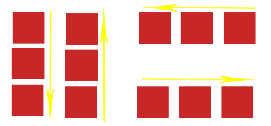
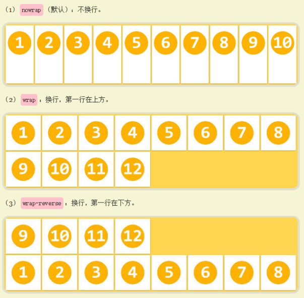
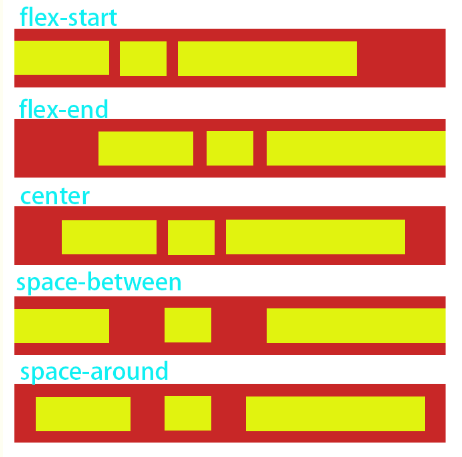
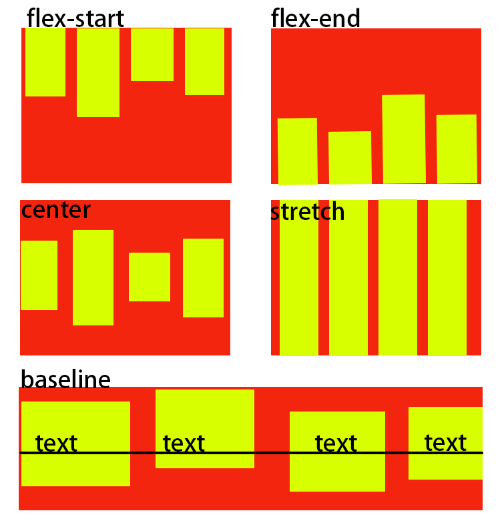
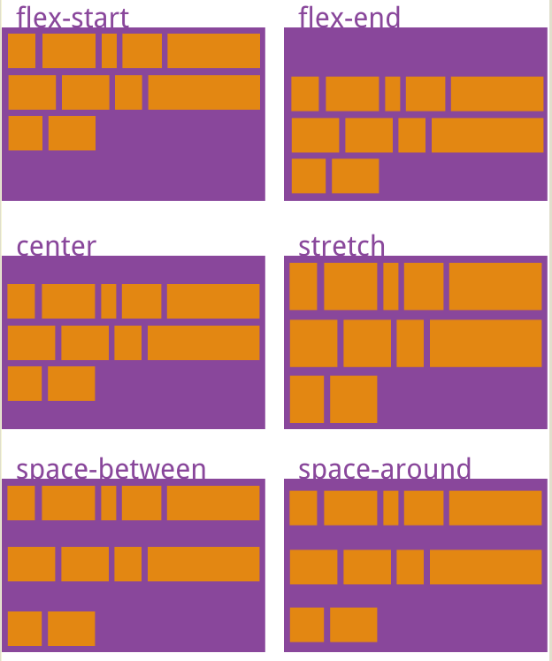

### 弹性布局相关样式

[参考链接]: https://www.cnblogs.com/Renyi-Fan/p/8116310.html
查看更多[参考链接]

#### 基本概念

* 容器：需要添加弹性布局的父元素
* 项目：弹性布局中的每一个子元素，称为项目

#### 如何使用弹性布局？

* 父容器添加`display: flex/inline-flex;`属性，子元素的position属性依然生效，但float、clear和vertical-align属性将失效
* 父容器添加弹性布局后，父容器本身仍然遵循常规文档流，内容则为弹性布局
* `display: flex`显示为块级元素，`display: inline-flex`显示为行内元素

#### 作用于容器的属性

* flex-direction 
决定主轴的方向，即容器的项目的排列方向，属性值包括： 
`row`：默认，主轴为水平方向，起点在左端 
`row-reverse`: 主轴为水平方式，起点子右端 
`column`：主轴为垂直方向，起点在上沿 
`column-reverse`：主轴为垂直方向，起点在下沿

* flex-wrap 
如何一个容器的轴线排不下众多项目时，可以通过设置属性决定项目的换行方式 
`nowrap`：默认，不换行。当容器宽度不够时，每个项目都会被挤压宽度 
`wrap`：换行，并且第一行在容器最上方 
`wrap-reverse`：换行，并且第一行在容器最下方

  

* flex-flow 
是`flex-direction`和`flex-wrap`的缩写形式，默认值是`row nowrap`

* justify-content 
定义了项目子主轴上的对齐方式 
`flex-strt`：默认值，项目位于主轴对齐 
`flex-end`：项目位于主轴终点 
`center`： 居中 
`space-between`：两端对齐，项目之间的间隔都相等 
`space-around`：每个项目两侧的间隔相等。所以，项目之间的间隔比项目与边框的间隔大一倍。(开头和最后的项目，与父容器的边缘有一定的间隔)

  

* align-items 
定义项目在交叉轴上的对齐方式 
`flex-start`：交叉轴的起点对齐 
`flex-end`：交叉轴的终点对齐 
`center`：交叉轴的中点对齐 
`baseline`: 项目的第一行文字的基线对齐。（文字的行高、字体大小会影响每行的基线） 
`stretch`：默认值，如果项目未设置高度或设为auto，将占满整个容器的高度

  

* align-content 
定义了多根轴线的对齐方式，如果项目只有一根轴线，该属性不起作用。当项目换为多行时，可以使用align-content取代align-items(单行时使用align-items，多行时使用align-content) 
`flex-start`：交叉轴的起点对齐 
`flex-end`：交叉轴的终点对齐 
`center`：交叉轴的中点对齐 
`space-between`：与交叉轴两端对齐，轴线之间的间隔平均分布。 
`space-around`：每根轴线两侧的间隔都相等。所以，轴线之间的间隔比轴线与边框的间隔大一倍。 
`stretch`：默认值，轴线占满整个交叉轴。

  

#### 作用于项目上的属性

`order`：属性定义项目的排列顺序。数值越小，排列越靠前，默认为0 
`flex-grow`：属性定义项目的放大比例，默认为0，即如果存在剩余空间，也不放大 
`flex-shrink`：属性定义了项目的缩小比例，默认为1，即如果空间不足，该项目将缩小 
`flex-basis`：定义项目占据的主轴空间。(如果主轴为水平，则设置这个属性，相当于设置项目的宽度，原width会失效) 
`flex`：属性是flex-grow, flex-shrink 和 flex-basis的简写，默认值为0 1 auto。后两个属性可选。这个属性有两个快捷设置： auto=(1 1 auto)/none(0 0 auto) 
`align-self`：定义单个项目自身在交叉轴上的排列方式，可以覆盖掉容器上的align-item属性。与align-items相同，默认值为auto，表示继承父容器的align-items属性值 