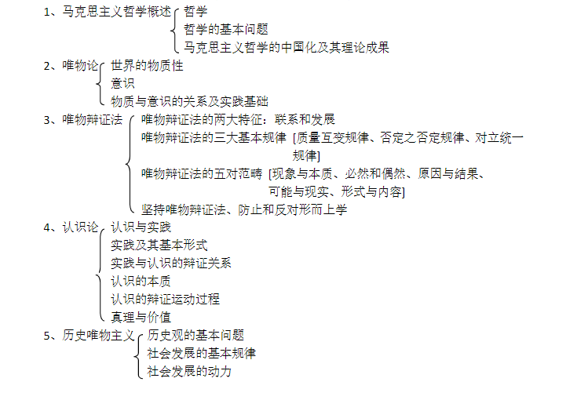

>subjects：radio/单选、checkbox/多选、indefinite options/不定选项、pratice/实务、discourse/论述、brief analysis/简析、writing/写作、case study/案例分析、comprehensive analysis/综合分析、materials analysis/材料分析

### points

* Principles of Marxist Philosophy `1、马克思主义哲学原理`
* Introduction to Mao Zedong Thought `2、毛泽东思想概论`
* Theoretical system of socialism with Chinese characteristics `3、中国特色社会主义理论体系`
* Government and politics in contemporary China `4、当代中国的政府与政治`
* Professional ethics of state organ staff `5、国家机关工作人员职业道德`
* Legal knowledge  `6、法律知识`
* Basic Chinese and official document Writing  `7、语文基础与公文写作部分`
* Economic knowledge and technological knowledge  `8、经济知识与科技知识`

## Chapter_1  `Principles of Marxist Philosophy`
<a href="#section-1-overview-of-marxist-philosophy">1  Overview of Marxist Philosophy `马克思主义哲学概述`</a><br>
<a href="#section-2-materialism">2 Materialism `唯物论`</a><br>
<a href="#section-3-materialism-dialectics">3 Materialism Dialectics`唯物辩证法`</a><br>
<a href="#section-4-epistemology">4 Epistemology`认识论`</a><br>
<a href="#section-5-historical-materialism">5 Historical Materialism`历史唯物主义`</a><br>
>

### Section_1 Overview of Marxist Philosophy 

#### 一、哲学
```bash
1. 哲学：
        是理论化、系统化的世界观；
        是`世界观`和`方法论`的统一；
        是自然知识、社会知识、思维知识的概括、总结；
2. 与具体科学，是`共性`与`个性`，`一般`与`特性`的关系；
   `具体科学`，是哲学的基础；
   哲学，随其他科学的发展而发展；
   哲学，给具体科学以世界观、方法论的指导，使之相互作用、相互促进

# keywords: 
# 1. theorization/theoretical, systematization/systematic, world view, methodology,
# 2. natural knowledge, social knowledge, thinking knowledge
# 3. specific science, commonality, personality, generality, charateristics
```

#### 二、哲学的基本问题
```bash
1.物质和意识的问题
  1️⃣ 谁为第一性 => 划分`唯物主义`、`唯心主义`的唯一标准。哲学两大派别的根本区别。
  2️⃣ 有无统一性 => 划分可知论、不可知论的标准。
                   `可知论`：一切的唯物主义 & 彻底的唯物主义
                   `不可知论`：本质上是唯心主义的一种表现
2.唯物主义和唯心主义、可知论和不可知论
  1️⃣ 唯心主义的基本类型：主观唯心主义 & 可观唯心主义

                                            区    别
        =---------------------------------------=---------------------------------=
         `主观唯心主义`                            `客观唯心主义`                  
        =---------------------------------------=---------------------------------=
         `人的精神`是世界的本源；                   `客观精神`是世界的本源；         
         如感觉、经验、心灵、意识、观念、意志；     某种客观精神或原则先于物质世界；  
         世界上的一切事物由此派生                  并独立于物质世界而存在；          
         极端主张`唯我论`。                        物质世界是这种客观精神的外化或表现。
        =---------------------------------------=---------------------------------=
         万物皆备于我；吾心即宇宙；                 事在理先；谋事在人，成事在天；
         存在就是被感知；人是万物的尺度。           上帝创造世界；
                                                   理论是事物存在的根据和模仿的原型。
        =---------------------------------------=---------------------------------=
  
  2️⃣ 唯物主义的历史形态
      三种形态：
              `古代朴素`唯物主义；
              `形而上学`唯物主义=机械唯物主义：机械性、形而上学、不彻底
              `现代`唯物主义：`辩证`唯物主义、`历史`唯物主义
3.马克思主义哲学
  1️⃣ 产生条件
      `社会历史条件`：资本主义经济高速发展、资本主义社会矛盾充分暴露；
      `阶级基础`：无产阶级与资产阶级矛盾上升为主要矛盾，无产阶级作为独立的政治力量登上历史舞台；
      `自然科学`：19世纪自然科学三大发现 —— 细胞学说、能量守恒与转化定律、生物进化论；
      `直接理论来源`：19世纪德国古典哲学，黑格尔的辩证法哲学，费尔巴哈的唯物主义哲学。
  2️⃣ 基本特征
      √（1）`第一次在实践的基础上实现了唯物主义和辩证法的统一；唯物主义的辩证法、辩证的唯物主义`
      √（2）`第一次实现了唯物主义的自然观和历史观的统一；将唯物辩证观念贯穿到社会历史领域；`
      √（3）`实现了实践基础上的科学性和革命性的统一；由它的实践性决定的、阶级性要求的。`
           科学性：坚持科学的实践观，全部理论来自实践又经过实践的反复检验。
           革命性：改变世界的科学，指导人类解放的科学，无产阶级革命的思想体系。
  3️⃣ 其他
      马克思主义`最根本的理论特征`：辩证唯物主义&历史唯物主义的世界观、方法论；
      马克思主义哲学`首要的基本观点`：实践的观点 —— 认识和改造世界的强大思想武器；
      马克思主义哲学区别于其他科学的`最主要最根本的特征`：实践性。

# keywords:
# substance/matter, awareness/consciousness, agnosticism
# materialism, idealism, subjective, objective
# Ancient Naive Materialism, metaphysics, dialectical materialism
# proletariat, bourgeosie, contradiction
# scientificity, revolutionary
```

#### 三、马克思主义哲学的中国化及其理论成功
```bash
第一成果，毛泽东思想；
第二成果，邓小平理论；
最新成果，中国特色社会主义理论体系。

# keywords:
# sinicication, Mao Zedong Thought, Deng Xiaoping Theory
# The theoretical system of socialism whith Chinese characteristics
```

### Section_2 Materialism 

#### 一、世界的物质性
```bash
1.物质的客观实在性
  1️⃣ 马克思主义的物质观
      `客观实在性，是物质的唯一特性。`
  2️⃣ 马克思主义物质观的理论意义
      坚持物质的“客观实在性”原则，坚持唯物主义一元论，同唯心主义一元论、二元论划清界限；
      坚持能动的反映论和可知论，批判不可知论；
      体现唯物主义自然观和唯物主义历史观的统一，为彻底的唯物主义奠定基础。
  3️⃣ 世界的物质统一性
      世界的本质是，物质、自然界、人类社会都是物质的，世界的真正统一性，在于它的物质性。
      （1）世界的物质统一性原理
        √ `世界是物质的，物质是运动的。`
          运动，是物质存在的方式和根本属性；
          运动，是标志一切事物和现象的变化及其过程的哲学范畴；
          不运动的物质 —— 导致形而上学；
          无物质的运动 —— 导致唯心主义。
        √ `运动是绝对的，静止是相对的。`
          静止，包括空间位置和根本性质暂时未变这两种运动的特殊状态；
          运动的绝对性，体现了物质运动的变动性、无条件性；
          静止的相对性，体现了物质运动的稳定性、有条件性。
        √ `时间和空间是物质运动的存在方式`
          时间，指物质运动的持续性、顺序性、特点是一维性；
          空间，指物质运动
      （2）社会的物质性表现
          人类社会依赖于自然界，是整个物质世界的组成部分；
          人类活动是以物质力量改造物质力量的活动，是物质性的活动；
          物质资料的生存方式，是人类社会存在和发展的基础，集中体现这人类社会的物质性。 
2.辩证唯物主义的实践观
  1️⃣ 实践的形式、特点
  2️⃣ 人对物质世界的实践把握
```

#### 二、意识
```bash

```

#### 三、物质与意识的关系及实践基础
```bash

```

### Section_3 Materialism Dialectics
### Section_4 Epistemology
### Section_5 Historical Materialism