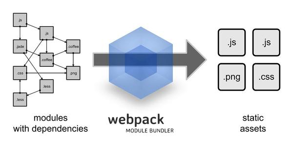
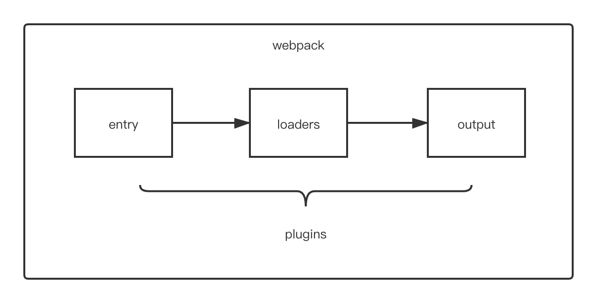

## 1、webpack是什么？

- 官方网站：[https://webpack.js.org/](https://webpack.js.org/)
- 中文网站：[https://www.webpackjs.com/](https://www.webpackjs.com/)



本质上，**webpack** 是一个现代 JavaScript 应用程序的**静态模块打包器**(module bundler)。当 webpack 处理应用程序时，它会`递归地`构建一个`依赖关系图`(dependency graph)，其中包含应用程序需要的`每个模块`，然后将所有这些模块打包成`一个或多个 bundle`。

### 1-1、安装

**webpack**是一个使用 `Node.js` 实现的一个**模块化代码打包工具**。所以，我们需要先安装 webpack，安装之前需要搭建好 Node.js 环境

```js
// 注：不推荐全局安装
npm install -D webpack webpack-cli
```

- **webpack-cli** : 提供 webpack 命令、工具，类似 create-react-app
- **webpack** : webpack 代码，类似 react

### 1-2、使用

```js
./node_modules/.bin/webpack

// 查看版本
./node_modules/.bin/webpack -v
```

也可以编辑 package.json 的 scripts 来简化输入

```js
// package.json
{
	...,
	"scripts": {
		"start": "webpack"	// scripts 中可以定位到 ./node_modules/.bin/ 目录下
	}
}

// scripts 中使用 test、start、restart、stop 命名的时候，
// 可以在调用的时候省略 run，即直接 npm start
```

还可以使用更加方便的方式：
```js
npx webpack
// 通过 npx 也可以帮助我们定位命令到 ./node_modules/.bin/ 目录下
// 注：npm5.2+ 增加，如果没有，可以使用 npm i -g npx 来安装
```

## 2、mode-核心配置

```js
模式 : "production" | "development" | "none"
```

- 不同的模式会对 webpack 打包的时候进行一些对应的优化配置。

```js
module.exports = {
  // mode: 'production'
  mode: 'development'
}
```

## 3、entry-核心配置

`入口文件`就是我们项目中加载的第一个文件，比如上面的 main.js 文件，其它文件都是通过 import 等方式引入的，webpack 会从我们指定的入口文件开始分析所有需要依赖的文件，然后把打包成一个完整文件。

- 指定打包⼊口⽂文件，有三种不同的形式：**string | object | array**

```js
module.exports = {
  entry: './src/index.js'
}
```

```js
module.exports = {
  entry: {
    'index1': "./src/index1.js",
    'index2': "./src/index2.js"
  }
}
```

```js
module.exports = {
  entry: [
    './src/index1.js',
    './src/index2.js',
  ]
}
```

## 4、output-核心配置

打包后的文件位置

```js
module.exports = {
  ...,
  output: {
  	path: path.resolve(__dirname, "dist"),
    // filename: "bundle.js",
		filename: "[name].js"
	}
}
```

- 可以指定一个固定的文件名称，如果是多入口多出口(entry 为对象)，则不能使用单文件出口，需要使用
  `filename: "[name].js"`
- 通过 webpack 内置的变量占位符：**[name]**

## 5、workflow-执行简要流程

- 在 webpack 中，有一个很重要的特性：模块不仅仅只是 js 的文件，webpack 可以把任意文件数据作为模块进行处理，包括：非 js 文本、css、图片等等

```js
import txt from './a.txt';
console.log(txt);
```
- 但是 webpack 默认情况下只能处理 js 模块，如果需要处理其它类型的模块，则需要使用它提供的一些其它功能


- **loaders**：webpack 中灰常核心的内容之一，前面我们说的非 js 类型的模块处理就靠它了。webpack 可以使用 loader 来预处理文件。这允许你打包除 JavaScript 之外的任何静态资源。你可以使用 Node.js 来很简单地编写自己的 loader。
- **plugins**：webpack 中另外一个核心的内容，它主要是扩展 webpack 本身的一些功能。插件可以运行在 webpack 的不同阶段（钩子 / 生命周期）。



## 6、[loaders](https://webpack.js.org/loaders/)-核心配置

```js
module.exports = {
  ...,
  module: {
  	rules:[
  		{
  			test:/\.xxx$/,
       	use:{
        	loader: 'xxx-load'
      	}
			}
  	]
	}
}
```

当 webpack 碰到不识别的模块的时候，webpack 会在配置的 module 中进行该文件解析规则的查找
- **rules** 就是我们为不同类型的文件定义的解析规则对应的 loader，它是一个数组
- 每一种类型规则通过 test 选项来定义，通过正则进行匹配，通常我们会通过正则的方式来匹配文件后缀类型
- **use** 针对匹配到文件类型，调用对应的 loader 进行处理

### 从一个简单的案例来了解 loader

```js
我是 txt 的内容
```

```js
# 我是 md 的内容
```

```js
import txtData from './datas/data.txt';
import mdData from './datas/data.md';

console.log('txtData: ', txtData);
console.log('mdData: ', mdData);
```

默认情况下，webpack 会报错，因为 webpack 处理不了 txt 和 md 这样的非 js 的模块，但是我们可以通过专门来处理纯文本内容(不同的 loader 有不同的作用)

### 8-1、raw-loader
`用于解析txt/md文件`,
在 webpack 中通过 import 方式导入文件内容，loader 并不是 webpack 内置的，所以首先要安装

```js
npm install --save-dev raw-loader
```
然后在 webpack.config.js 中进行配置
```js
module.exports = {
  ...,
  module: {
      rules: [
      {
        test: /\.(txt|md)$/,
        use: 'raw-loader'
    	}
    ]
	}
}
```

### 8-2、file-loader

把识别出的资源模块，移动到指定的输出⽬目录，并且返回这个资源在输出目录的地址(字符串)

```js
npm install --save-dev file-loader
```
```js
rules: [
  ...,
	{
		test: /\.(png|jpe?g|gif)$/,
    use: {
      loader: "file-loader",
      options: {
        // placeholder 占位符 [name] 源资源模块的名称
        // [ext] 源资源模块的后缀
        name: "[name]_[hash].[ext]",
        //打包后的存放位置
        outputPath: "./images",
        // 打包后文件的 url
        publicPath: './images',
      }
    }
	}
]
```

占位符：[https://webpack.js.org/loaders/file-loader#placeholders](https://webpack.js.org/loaders/file-loader#placeholders)

### 8-3、url-loader

可以处理 file-loader 所有的事情，但是遇到图片格式的模块，可以选择性的把图片转成 base64 格式的字符串，并打包到 js 中，对⼩体积的图片⽐较合适，⼤图⽚不合适。

```js
npm install --save-dev url-loader
```

```js
rules: [
  ...,
	{
		test: /\.(png|jpe?g|gif)$/,
    use: {
      loader: "url-loader",
      options: {
        // placeholder 占位符 [name] 源资源模块的名称
        // [ext] 源资源模块的后缀
        name: "[name]_[hash].[ext]",
        //打包后的存放位置
        outputPath: "./images"
        // 打包后文件的 url
        publicPath: './images',
        // 小于 100 字节转成 base64 格式
        limit: 100
      }
    }
	}
]
```

### 8-4、css-loader

分析 css 模块之间的关系，并合成⼀个 css

```js
npm install --save-dev css-loader
```

```js
rules: [
  ...,
	{
		test: /\.css$/,
    use: {
      loader: "css-loader",
      options: {
  			// 启用/禁用 url() 处理
  			url: true,
  			// 启用/禁用 @import 处理
  			import: true,
        // 启用/禁用 Sourcemap
        sourceMap: false
      }
    }
	}
]
```

### 8-5、style-loader

把 css-loader 生成的内容，用 style 标签挂载到⻚面的 head 中

```js
npm install --save-dev style-loader
```

```js
// 同一个任务的 loader 可以同时挂载多个，处理顺序为：从右到左，
// 也就是先通过 css-loader 处理，然后把处理后的 css 字符串交给 style-loader 进行处理
// rules: [
//   ...,
// 	{
// 		test: /\.css$/,
//     use: ["style-loader", "css-loader"]
// 	}
// ]

rules: [
  ...,
	{
		test: /\.css$/,
    use: [
  		{
  			loader: 'style-loader',
  			options: {}
  		},
      'css-loader'
		]
	}
]
```

## 7、打包模块

### 打包命令

使用 webpack `默认的一些配置`对模块文件进行打包，并把打包后的文件输出到`默认创建的 ./dist 目录`下，打包后的文件名称`默认为 main.js`。

模块文件打包以后，就可以在不支持 es6 模块语法的浏览器环境下引入使用了。

```js
webpack ./js/index.js
```

### 打包文件分析

- 把分散的模块文件打包到一个文件中，不需要外部引入了
- 内置了一个小型模块加载器(类似 requireJS)，实现了打包后的代码隔离与引用

以上就是 webpack 最基础的使用于基本原理，当然强大的 webpack 远远不止这些功能。

### 打包配置

虽然，我们可以直接通过命令的来打包，但是推荐创建一个**webpack.config.js** 的配置文件来实现更方便和强大的功能。

webpack 命令在运行的时候，默认会读取运行命令所在的目录下的 **webpack.config.js** 文件，通常我们会在项目的根目录下运行命令和创建配置文件。

我们也可以通过 —config 选项来指定配置文件路径：
```js
webpack --config ./configs/my_webpack.config.js
```

通常情况下，我们的项目目录大致如下：

```json
/
-- /dist - 项目打包后存放目录
-- /node_modules - 第三方模块
-- /src
------ css/
------ images/
------ js/
------ index.js
-- webpack.config.js
-- package.json
```

## 9、练习

```
使用webpack构建打包一个基础项目，需要实现如下需求： 
1、 创建一个 src 目录存放项目源文件 
2、src 下创建项目入口文件 index.js 
3、src 创建一个目录 images ，images 目录下存放一张图片 logo.png 
4、src 创建一个文件 fn.js ，fn.js 中需要通过 export default 100， 导出数据 
5、src 创建一个 css 目录，css 目录下创建一个 css.css 文件，写入样式 body {background: red} 
6、index.js 中使用 import 方法分别引入 images 下的 logo.png 、fn.js、以及 css 目录下的 css.css 文件 
7、项目根目录下创建一个 webpack.config.js 配置文件 
8、 运行 webpack 打包后，在项目下自动生成 dist 目录，并生成对应的打包文件 
9、创建一个html文件并通过 script 标签引入 dist 目录下生成的 js 文件
```

[github代码](https://github.com/zy13/webpack-demo/tree/2-webpack-base)