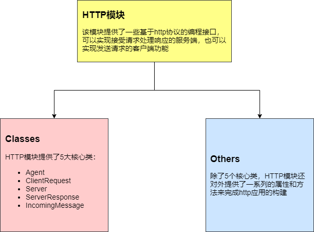

## 1、为什么要搭建webServer?
>一切的一切都是为了：共享资源。让所有人都能访问页面、图片、文档等资源。比如，如何让别人访问自己电脑上的图片

* webServer
>将电脑上的资源通过某种方式提供给别人访问。

## 2、webServer核心工作流程


## 3、如何搭建一个webServer?
原则上使用任何语言都能够编写一个webServer，只要该语言提供了针对网络进行编程的接口，实际上也存在很多通过各种语言编写的功能强大的，稳定的webServer应用程序，如：
* Nginx（https://github.com/nginx/nginx）
* Apache HTTP Server（）
* Apache Tomcat（）
* IIS
* ...

## 4、为什么选择Node.js?
Node的源码：https://github.com/nodejs/node
* Node.js有着与JavaScript相同的语法特性，对熟悉JavaScript的前端同学比较友好
* Node.js内置了Net模块，使得我们可以针对网络进行编程，实现一个webServer
* Node.js还可以编写各种工具（webpack、各种框架的CLI工具等等）

## 5、使用Node.js构建一个基础的webServer

### 5-1、Node.js中的http模块
使用Node.js构建一个WebServer，需要使用Node.js中的http模块提供的接口来完成。

http模块文档：https://nodejs.org/dist/latest-v15.x/docs/api/http.html




**基于Node.js的http模块的服务端基本工作流**


- Server类：监听数据，处理请求； 

### 5-2、创建一个WebServer对象
```js
// 引入http模块
const htpp = require('http')

// 创建http.Server对象
// 1.通过http.Server类创建
const server = http.server()
const server = new http.Server()

// 2.通过createServer函数创建
const server = http.createServer()
```