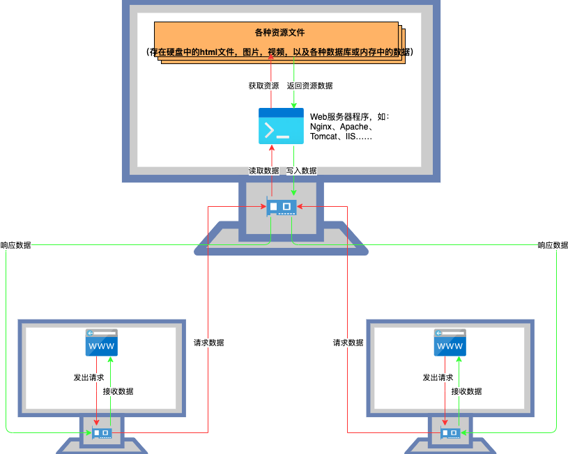
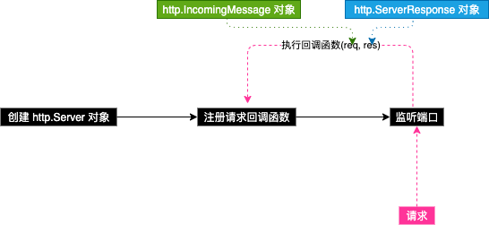

## nodejs安装及使用

### nodejs介绍

- Node.js 诞生于2009年，Node.js采用C++语言编写而成，是 一个Javascript的运行环境。Node.js 是一个基于 Chrome V8 引擎的 JavaScript 运行环境 ，让JavaScript的运行脱离浏览器端，可以使用JavaScript语言 书写服务器端代码。


### 安装Node.js

​	[Node.js官网](https://nodejs.org)下载稳定版本,node偶数版本为稳定版本，奇数版本为非稳定版本。

- mac 直接安装  或者 brew来安装

- 安装完Node.js会自动安装NPM(Node Package Manager)：包管理工具；
- 通过指令 node -v 来查看是否安装完成和查看node版本号；npm -v 来查看npm版本。

### 使用Node.js实现第一个服务器

初步感受Node.js
```js
//引入http模块
let http = require("http");
//创建一个服务器
let serve = http.createServer((req,res)=>{
    console.log("hello");
    res.end("hello world");
})
//设置端口号
serve.listen(3000);
```

- Google Chrome 默认非安全端口列表，尽量避免以下端口。

    1,    // tcpmux
    7,    // echo
    9,    // discard
    11,   // systat
    13,   // daytime
    15,   // netstat
    17,   // qotd
    19,   // chargen
    20,   // ftp data
    21,   // ftp access
    22,   // ssh
    23,   // telnet
    25,   // smtp
    37,   // time
    42,   // name
    43,   // nicname
    53,   // domain
    77,   // priv-rjs
    79,   // finger
    87,   // ttylink
    95,   // supdup
    101,  // hostriame
    102,  // iso-tsap
    103,  // gppitnp
    104,  // acr-nema
    109,  // pop2
    110,  // pop3
    111,  // sunrpc
    113,  // auth
    115,  // sftp
    117,  // uucp-path
    119,  // nntp
    123,  // NTP
    135,  // loc-srv /epmap
    139,  // netbios
    143,  // imap2
    179,  // BGP
    389,  // ldap
    465,  // smtp+ssl
    512,  // print / exec
    513,  // login
    514,  // shell
    515,  // printer
    526,  // tempo
    530,  // courier
    531,  // chat
    532,  // netnews
    540,  // uucp
    556,  // remotefs
    563,  // nntp+ssl
    587,  // stmp?
    601,  // ??
    636,  // ldap+ssl
    993,  // ldap+ssl
    995,  // pop3+ssl
    2049, // nfs
    3659, // apple-sasl / PasswordServer
    4045, // lockd
    6000, // X11
    6665, // Alternate IRC [Apple addition]
    6666, // Alternate IRC [Apple addition]
    6667, // Standard IRC [Apple addition]
    6668, // Alternate IRC [Apple addition]

    6669, // Alternate IRC [Apple addition]

## 模块化

一、为什么会有模块化

- 在JavaScript发展初期就是为了实现简单的页面交互逻辑，寥寥数语即，如今随着前端代码日益膨胀

  这时候JavaScript作为嵌入式的脚本语言的定位动摇了，JavaScript却没有为组织代码提供任何明显帮助，JavaScript极其简单的代码组织规范不足以驾驭如此庞大规模的代码；

二、Node.js中的模块化  commonjs规范

- CommonJS就是为JS的表现来制定规范，因为js没有模块的功能所以CommonJS应运而生，它希望js可以在任何地方运行，不只是浏览器中。

  1、创建自定义模块

  - 引入一个文件 形式模块

    home.js执行文件

    ```js
    //通过require来引入
    require("./aModule"); //注意一定要有"./"，文件后缀可加可不加。
    ```

    amodule.js文件

    ```js
    console.log("我是amodule模块111");
    ```

  - 引入文件夹形式模块

    - home.js执行文件

    ```js
    require("./aModuledir"); //必须加"./"
    ```

    ​       aModuleDir里的index.js文件,会自动查找文件夹下的index.js文件执行

    ```js
    console.log("我是aModule模块文件夹");
    ```

    - 当然也可以配置默认启动文件，在文件夹内新建package.json来指定执行文件

    ```json
    {
      "name":"aModule",
      "version":"1.0.0",
      "main":"test.js"
    }
    ```

    

- 自定义模块的按需导出

  通过module.exports 导出； \_\__dirname  , \_\_filename

  ```js
  module.exports = {
      a:"我是a的值",
      b(){
          console.log("我是导出的b函数");
      }
  }
  ```

  引入导出文件

  ```js
  let mymodule = require("bModule");
  console.log(mymodule.a);
  mymodule.b();
  ```

  或者 通过  exports来导出

  ```js
  exports.fn = function(){
      console.log("我是fn函数");  
  }
  ```

  导入文件

  ```js
  let myfn = require("bModule").fn;
  myfn();
  // 或者 通过解构赋值 
  let { fn } = require("bModule");
  fn();
  ```

- 模块加载的优先级 ,先文件再目录；

2、内置模块；

nodejs内置模块有：Buffer，C/C++Addons，Child Processes，Cluster，Console，Crypto，Debugger，DNS，Domain，Errors，Events，File System，

Globals，HTTP，HTTPS，Modules，Net，OS，Path，Process，P unycode，Query Strings，Readline，REPL，Stream，String De coder，Timers，TLS/SSL，TTY，UDP/Datagram，URL， Utilities，V8，VM，ZLIB；内置模块不需要安装，外置模块需要安装；

## http搭建服务器

### 创建服务
```js
const http = require('http')
const server = http.createServer((req,res) => {
  res.write('hello world -123')
  res.end()
})
server.listen(3000)
```

## fs文件系统

### 知识点
- [1-writeFile：创建/修改文件](#_1-writefile：创建-修改文件)
- [2-readFile：读取文件](#_2-readFile：读取文件)
- [3-rename：文件重命名](#_3-rename：文件重命名)
- [4-unlink：删除文件](#_4-unlink：删除文件)
- [5-copyFile：复制文件](#_5-copyFile：复制文件)
- [6-mkdir：创建目录](#_6-mkdir：创建目录)
- [7-readdir：读取目录](#_7-readdir：读取目录)
- [8-rmdir：删除目录](#_8-rmdir：删除目录)
- [9-exists：判断是否存在目录/文件](#_9-exists：判断是否存在目录/文件)
- [10-stat.js](#_10-stat.js)

### 1-writeFile：创建/修改文件
```js
const fs = require('fs')

/**
 * 1.创建文件
 * flag: 'w' //默认值
 */
function writFile() {
  fs.writeFile('demo/1.txt','写入文件1',err=>{
    if(err){
      return console.log(err)
    }
    console.log('创建成功')
  })
}
// writFile()

/**
 * 修改文件
 * flag: 'a'（追加内容）
 */
function accessFile() {
  fs.writeFile('demo/1.txt',' 追加的内容：666',{flag:'a'},err=>{
    if(err){
      return console.log(err)
    }
    console.log('追加内容成功')
  })
}
accessFile()

```

### 2-readFile：读取文件
```js
const fs = require('fs')

/**
 * 读取文件
 * 文本解析：'utf-8'; toString()
 */
function readFile(type) {
  fs.readFile('demo/1.txt',type, (err,data) => {
    if(err) {
      return console.log(err)
    }
    if(type) {
      console.log('utf-8：\n',data)
    } else {
      console.log('Buffer格式：\n',data)
      console.log('toString转换Buffer格式：\n',data.toString())
    }
  })
}

readFile('utf-8')
readFile()

/**
 * 同步读取文件
 * 所有文件操作，没有加Sync都是异步，否则是同步（没有回调函数，只有返还值）
 * @param {*} type
 */
function readFileSync(type) {
  let data = fs.readFileSync('demo/1.txt',type)
  if(type) {
    console.log('同步读取文件：',data)
  } else {
    console.log('同步读取文件：',data.toString())
  }
}
readFileSync()
```

### 3-rename：文件重命名
```js
const fs = require('fs')

/**
 * 修改文件/目录名称
 *
 */
function rename(src,myname) {
  fs.rename(src,myname,err=>{
    if(err) {
      return console.log(err)
    }
    console.log('修改成功！')
  })
}
// rename('demo/2.txt','demo/2-2.txt')
// rename('demo/mydir','demo/mydir-1')

/**
 * 同步修改文件名
 *
 */
function renameSync() {
  fs.renameSync('demo/2-2.txt', 'demo/2-2.html')
}
// renameSync()
```

### 4-unlink：删除文件
```js
const fs = require('fs')

/**
 * 删除文件
 *
 */
function unlink() {
  fs.unlink('demo/33/33.txt',err=>{
    if(err){
      return console.log(err)
    }
    console.log('删除成功')
  })
}
// unlink()

function unlinkSync() {
  fs.unlinkSync('demo/33/333.txt')
}
unlinkSync()
```

### 5-copyFile：复制文件
```js
const fs = require('fs')

/**
 * 复制
 */
function copyFile() {
  fs.copyFile('demo/3.txt','demo/33/copy-3.txt', err => {
    if(err){
      return console.log(err)
    }
    console.log('复制成功')
  })
}
// copyFile()

/**
 * 同步复制
 */
function copyFileSync() {
  fs.copyFileSync('demo/3.txt','demo/33/copy-33.txt')
}
// copyFileSync()

/**
 * 复制：先读取 再写入
 */
function myCopyFile(src,filename) {
  let data = fs.readFileSync(src,'utf-8')
  fs.writeFile(filename, data, err => {
    if(err){
      return console.log(err)
    }
    console.log('复制成功！')
  })
}
myCopyFile('demo/1.txt', 'demo/my-copy-1.txt')

```

### 6-mkdir：创建目录
```js
const fs = require('fs')

/**
 * 创建目录
 */
function mkdir() {
  fs.mkdir('demo/mkdir',err=>{
    if(err){
      return console.log(err)
    }
    console.log('目录创建成功')
  })
}

mkdir()
```

### 7-readdir：读取目录
```js
const fs = require('fs')

/**
 * 读取目录
 */
function readdir() {
  fs.readdir('demo/33',(err,data)=>{
    if(err){
      return console.log(err)
    }
    console.log(data)
  })
}
readdir()

function readdirSync() {
  let data = fs.readdirSync('demo/33')
  console.log(data)
}
readdirSync()
```

### 8-rmdir：删除目录
```js
const fs = require('fs')

/**
 * 删除
 * 1.空目录
 */
function rmdir(src) {
  fs.rmdir(src,err=>{
    if(err){
      return console.log(err)
    }
    console.log('目录删除成功')
  })
}
// rmdir('demo/33/333/tt')

/**
 * 删除
 * 2.先把目录的文件删除==>删除空目录
 * 55
 */
function myRmdirSync(path) {
  let data = fs.readdirSync(path)
  data.forEach(item => {
    let url = path + '/' + item
    let stat = fs.statSync(url)
    if(stat.isDirectory()){
      // 目录：继续查找
      myRmdirSync(url)
    } else {
      // 文件：删除
      fs.unlinkSync(url)
    }
  })
  fs.rmdirSync(path)
}
myRmdirSync('demo/55')
```

### 9-exists：判断是否存在目录/文件
```js
const fs = require('fs')

/**
 * 判断文件/目录是否存在
 */
function exists(src) {
  fs.exists(src,exists=>{
    console.log(exists)
  })
}

exists('demo/mkdir')
exists('demo/mydir-1')
```

### 10-stat.js
```js
const fs = require('fs')

/**
 * 获取文件/目录的详细信息
 */
function stat(src) {
  fs.stat(src,(err,stat)=>{
    if(err) {
      return console.log(err)
    }
    // console.log(stats)
    // 判断是否是文件
    let isfile = stat.isFile()
    console.log('文件',isfile)
    // 判断是否是目录
    let isdir = stat.isDirectory()
    console.log('目录',isdir)
  })
}
stat('demo/1.txt')
stat('demo/mydir-1')

/**
 * 同步获取文件/目录的详细信息
 *
 * @param {*} src
 */
function statSync(src) {
  let stat = fs.statSync(src)
  console.log(stat)
  // 判断是否是文件
  let isfile = stat.isFile()
  console.log('文件',isfile)
  // 判断是否是目录
  let isdir = stat.isDirectory()
  console.log('目录',isdir)
}
// statSync('demo/1.txt')
// statSync('demo/mydir-1')
```

## buffer缓存区

- buffer的创建
  - 直接创建
  - 数组创建
  - 字符串创建
  - 乱码的处理
  - buffer转换toString

### 创建buffer
```js
let buffer1 = new Buffer(10)
let buffer2 = Buffer.alloc(10)
let buffer3 = Buffer.from('大家好')
let buffer4 = Buffer.from([0xe5,0xa4,0xa7,0xe5,0xae,0xb6,0xe5,0xa5,0xbd])
```

### buffer转换toString
```js
let buffer3 = Buffer.from('大家好')
let buffer4 = Buffer.from([0xe5,0xa4,0xa7,0xe5,0xae,0xb6,0xe5,0xa5,0xbd])
let res = buffer4.toString()
```

### 乱码的处理
```js
let b1 = Buffer.from([0xe5,0xa4,0xa7,0xe5])
let b2 = Buffer.from([0xae,0xb6,0xe5,0xa5,0xbd])
console.log(b1.toString())
let res = Buffer.concat([b1,b2])
console.log(res.toString())
```

```js
let { StringDecoder } = require('string_decoder')
let decoder = new StringDecoder()
let res1 = decoder.write(Buffer.from([0xe5,0xa4,0xa7,0xe5]))
let res2 = decoder.write(Buffer.from([0xae,0xb6,0xe5,0xa5,0xbd]))
console.log(res1+res2)
```

## stream流

- stream流：流与数据处理方面密不可分
  - 流的原理
  - 流数据的获取
    - createReadStream
    - data
    - end
  - copy的流方法实现
    - createReadStream
    - createWriteStream
    - pipe
  - 加载视图的流方法实现?


### 流数据的获取
```js
const fs = require('fs')
let rs = fs.createReadStream('demo/1.txt')
rs.on('data',chunck=>{
  console.log(chuck.toString())
})
```

```js
const fs = require('fs')
let buffer = Buffer.alloc(65*1024)
fs.writerFile('demo/65kb',buffer,err=>{
  if(err){
    return console.log(err)
  }
  console.log('写入成功')
})
let rs = fs.createReadStream('demo/65kb')
let num = 0
rs.on('data',chunk=>{
  num++
  console.log(chunk)
  console.log(num)
})
rs.on('end',()=>{
  console.log('读取成功')
})
```

### 流方法实现文件复制
```js
let rs = fs.createReadStream('demo/65kb')
let ws = fs.createWriteStream('demo/65-stream')
rs.pipe(ws)
```

## 总结

- nodejs的安装及使用
- 服务端与客户端
- commonjs模块化
- fs模块化的使用（文件操作及目录操作）
- buffer
- stream

## webserver

# 使用Node.js构建一个web服务端程序

### 1.为什么要搭建webserver?

>为了共享资源

### 2.Webserver核心工作流程



### 3.如何搭建一个Webserver?

原则使用任何语言都能够编写一个 WebServer，只要该语言提供了针对网络进行编程的接口，实际上也存在很多通过各种语言编写的功能强大、稳定的 WebServer 应用程序，如：

- Nginx ([https://github.com/nginx/nginx](https://github.com/nginx/nginx))
- Apache HTTP Server ([https://github.com/apache/httpd](https://github.com/apache/httpd))
- Apache Tomcat ([https://github.com/apache/tomcat](https://github.com/apache/tomcat))
- IIS
- ……

### 4、为什么要选择 Node.js

- Node.js 有着与 JavaScript 相同的语法特性，对熟悉 JavaScript 的前端同学比较友好
- Node.js 内置了 Net 模块，使得我们可以针对网络进行编程，实现一个 WebServer
- Node.js 还可以编写各种工具（Webpack、各种框架的CLI工具、等等等等）

### 5、使用 Node.js 构建一个基础的 WebServer

首先，我们需要在运行 Node.js 代码的机器上安装 Node.js 的解析运行工具（也就是搭建 Node.js 运行时环境）。正如我们通过浏览器去运行 HTML 代码一样。

在实现 WebServer 的过程中，我们会使用到 Node.js 提供的各种内置功能模块，学习查看、参考文档能够帮助我们更好的提高学习能力。

Node.js 官方文档：[https://nodejs.org/en/docs/](https://nodejs.org/en/docs/)


- **Node.js 中的 http 模块**

要是用 Node.js 构架一个 WebServer，需要使用 Node.js 中的 http 模块提供的接口来完成。

http 模块文档：[https://nodejs.org/dist/latest-v14.x/docs/api/http.html](https://nodejs.org/dist/latest-v14.x/docs/api/http.html)


- **基于 Node.js 的 http 模块的服务端基本工作流**



- **创建一个 WebServer 对象**

```js
// 引入 http 模块
const http = require('http');

// 创建 http.Server 对象
// 1、通过 http.Server 类创建
const server = new http.Server();
// 2、通过 createServer 函数创建
const server = http.createServer();
```

- **注册请求回调函数**

通过 `http.Server` 对象的 `request` 事件来监听每一次请求。

```js
server.on('request', callback);
```

或者在创建 `http.Server` 对象的时候通过 `requestListener` 参数传入。

```js
const server = http.createServer(callback);
```

- **监听网络端口**

系统中每一个需要通过网络交换数据的应用程序（如：QQ、微信、浏览器……）都需要监听指定的网卡（IP）和对应端口。


```js
// 0.0.0.0 通配所有IP
server.listen(8888, '0.0.0.0');
```

- **处理响应数据**

**http.ServerResponse**

`HTTP` 模块封装提供了一个 `http.ServerResponse` 类来完成数据的响应，它会在请求回调函数执行过程中实例化，并通过请求回调函数的第二个参数来进行调用。

```js
server.on('request', (req, res) => {
  // res => new http.ServerResponse()
  // chunk => 要写入的数据
  res.write(chunk);
  // 完成数据写入
  res.end(chunk?);
});
```

> end() 调用以后，不可在 write() 写入数据。

- **解析请求数据**

通常服务端提供的资源特别丰富，为了定位和标识互联网中资源，就定义一套规范：URI，其中包含了两个子集：URL、URN

**URL**

统一资源定位系统（uniform resource locator;URL）

**参考**

- URI : https://baike.baidu.com/item/URI/2901761

常见格式：


**http.IncomingMessage**

`HTTP` 模块封装提供了一个 `http.IncomingMessage` 用来解析和获取请求相关信息，如果我们想获取当前请求相关的一些信息，就可以通过这个对象来完成。

```js
server.on('request', (req, res) => {
  // req => new IncomingMessage();
  // req.url: 当前请求的 url（路径部分）
  // req.url 默认为 / ，表示根路径
  console.log(req.url)
})
```

### 6、静态资源 VS 动态资源


许多时候，我们会把资源简单的划分成：

- 静态资源
- 动态资源

- **静态资源解析与响应**

相对不变的内容（除非你修改了它的内容），类似程序中的 变量与常量。

> url 是表示网络资源的虚拟路径，与实际返回的资源存放的路径并不完全等同，如：
>
> 访问 http://localhost:8888/hello 经过对应的 WebServer 应用程序进行解析，返回了 WebServer 服务器的 D://kkb/1.html 文件的内容。
>
> 所以一个 url 不能简单的与某个文件关联起来，需要看对应的 WebServer 的具体逻辑。

- #### 规范高效的静态资源解析与响应

通常，我们的 WebServer 会提供各种静态资源（html代码、css代码、js代码、图片……），而这些资源我们又通常会通过文件的方式存储在某个地方。为了批量处理这种资源与 URL 的对应关系，我们会根据某种规则（规则自己定义，或者说由实现WebServer的各种软件和框架）来自动映射。

### 7、HTTP 协议

超文本传输协议（英文：**H**yper**T**ext **T**ransfer **P**rotocol，缩写：HTTP）是一种用于分布式、协作式和超媒体信息系统的应用层协议。HTTP是万维网的数据通信的基础。

客户端 <=> 服务端 数据通信规范。

**参考**

https://developer.mozilla.org/zh-CN/docs/Web/HTTP/Overview

### 7-1、HTTP 报文

报文：发送和响应的数据，HTTP 协议会在数据传输过程中对数据进行一定格式的组织。报文又分为两种类型：

- 请求报文
- 响应报文

- #### 请求方式

https://developer.mozilla.org/zh-CN/docs/Web/HTTP/Methods

- #### 响应状态码

https://developer.mozilla.org/zh-CN/docs/Web/HTTP/Status

- #### 头信息

https://developer.mozilla.org/zh-CN/docs/Web/HTTP/Headers

- #### MIME

https://baike.baidu.com/item/MIME/2900607

http://www.iana.org/assignments/media-types/media-types.xhtml

### 8、动态资源解析与响应

与静态资源不同，同一个 URL 返回的内容并不固定，比如访问 /now 这个 URL，即使不做任何修改，你就有可能得到不一样的结果，这就是动态资源。

### 9、数据与视图结构的分离

许多时候，动态资源会相对复杂一些，有的时候需要根据业务产生一些数据，同时又会把这个数据进行一些包装（嵌入到HTML代码）中，如果每次都字符串拼接去做会比较麻烦：

- 拼接数据和html字符串毕竟麻烦，且容易出错。
- 逻辑处理很繁琐，同样也容易出错。
- 不容易维护，前端页面处理（html、css等）和后端（Node.js）代码混合。
- ……

### 10、模板引擎

把数据与某个模板文件（通常是类似HTML，但是又包含了一些特殊定义的语法的字符串/文件），进行结合，利用引擎（写好的方法）去对模板文件中的特殊语法（模板引擎定义语法 - 语法取决于具体模板引擎）进行解析，得到最终的 HTML 字符串。


#### Nunjucks

参考：


